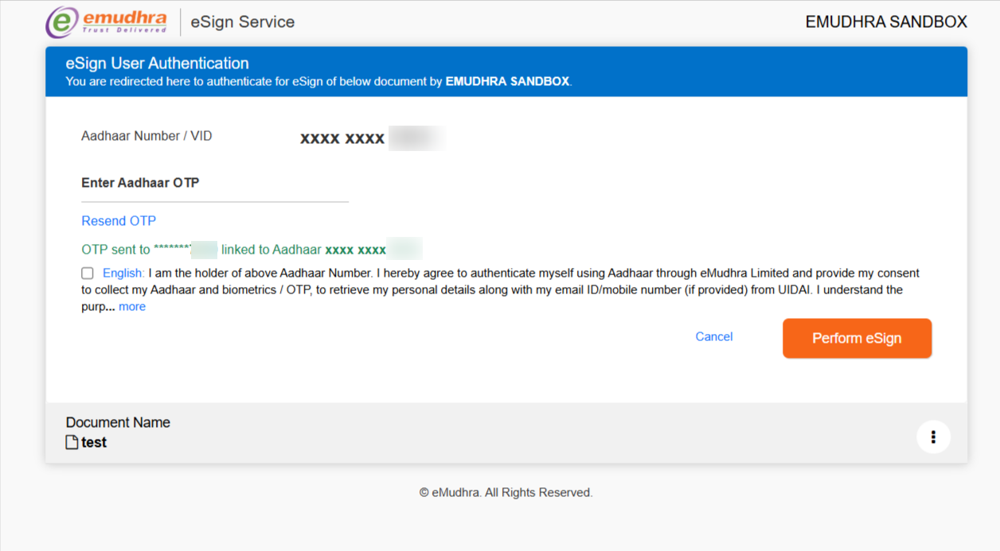
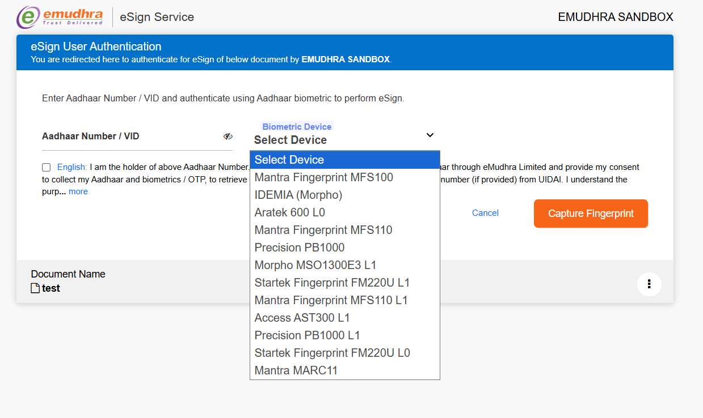
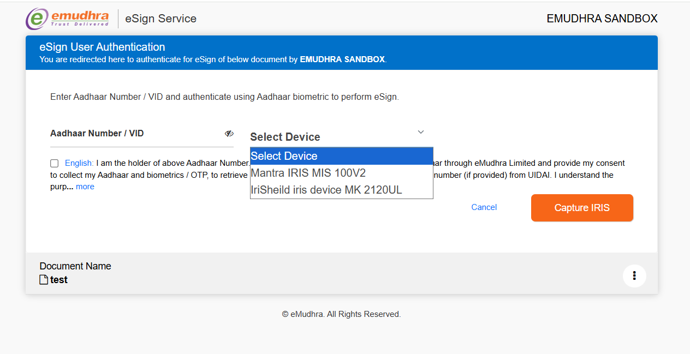
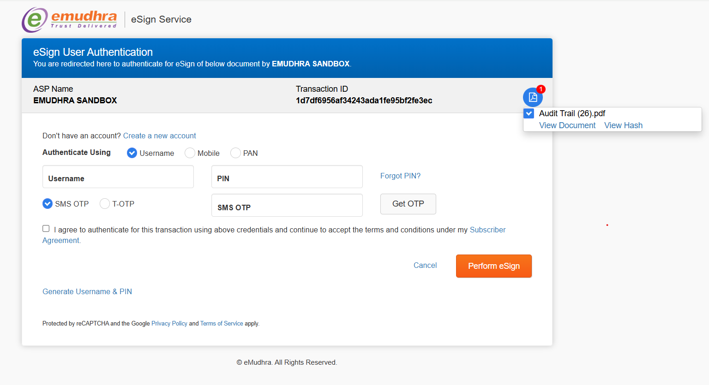

# eSign Java SDK - Integration Guide

A Java SDK for PDF digital signing. Supports signing via **eMudhra's eSign gateway** (Aadhaar/PAN-based authentication) and **any external signing authority** (HSM, TSP, or corporate CA) through a vendor-agnostic API.

## Table of Contents

- [Overview](#overview)
- [Prerequisites](#prerequisites)
- [Quick Start](#quick-start)
- [Signing Flows](#signing-flows)
  - [Aadhaar Signing (V2 API)](#aadhaar-signing-v2-api)
  - [Encrypted Aadhaar Flow](#encrypted-aadhaar-flow)
  - [PAN Signing (V3 API)](#pan-signing-v3-api)
  - [Vendor-Agnostic Signing](#vendor-agnostic-signing)
- [Signature Appearance Types](#signature-appearance-types)
- [Page Selection and Coordinates](#page-selection-and-coordinates)
- [Multi-Document Signing](#multi-document-signing)
- [Hash-Based Signing](#hash-based-signing)
- [API Reference](#api-reference)
  - [Constructors](#constructors)
  - [Methods](#methods)
  - [eSignInputBuilder](#esigninputbuilder)
  - [eSignServiceReturn](#esignservicereturn)
  - [ReturnDocument](#returndocument)
  - [Enums](#enums)
- [Error Codes](#error-codes)
- [Logging](#logging)
- [Building from Source](#building-from-source)

---

## Overview

### eMudhra Gateway Flow (Aadhaar / PAN)

```
Phase 1: getGatewayParameter()
  Your App --> SDK (pre-sign PDF, compute hash) --> eSign Gateway --> Returns redirect URL

Phase 2: User Authentication + getSigedDocument()
  User --> eMudhra Portal (OTP/Fingerprint/IRIS/Face) --> Your Callback URL --> SDK (inject signature + patch appearance)
```

1. **Phase 1** - Your application sends the PDF to the SDK. The SDK creates a signature placeholder, computes a SHA-256 hash, builds an XML request, signs it with your PFX certificate, and POSTs to the eSign gateway. You get back a gateway parameter to redirect the user.

> **Exception:** in the [Encrypted Aadhaar Flow](#encrypted-aadhaar-flow) Phase 1 makes **no** call to the eSign gateway - the SDK pre-signs the PDF, signs the request XML and returns a wrapper that your application posts to the gateway itself.

2. **Phase 2** - The user authenticates on eMudhra's portal. eMudhra sends the PKCS7 signature back to your callback URL. You pass it to the SDK, which injects the signature into the pre-signed PDF and returns the signed document as Base64.

> **Note:** After injecting the PKCS7 signature, the SDK automatically patches the visual appearance of every signature field with the signer's name and masked Aadhaar number (e.g. `**** **** 1234`) extracted from the gateway-returned certificate.

### Vendor-Agnostic Flow (any PKI / HSM / TSP)

```
prepareDocuments()  -->  SHA-256 hash per document
Your signing service (HSM / TSP / corporate CA)  -->  PKCS7 per document
appendSignatures()  -->  signed PDF per document
```

Use `prepareDocuments()` and `appendSignatures()` to decouple PDF processing from the signing authority. The SDK handles placeholder creation and PKCS7 injection; you supply the signatures from any source. See [Vendor-Agnostic Signing](#vendor-agnostic-signing).

---

## Prerequisites

- **Java 11** or higher
- **eSignASPLibrary5_12.jar** (the SDK JAR from `dist/`)
- **All dependency JARs** from the `lib/` folder:
  - batik-all-1.17.jar
  - commons-io-2.14.0.jar
  - log4j-api-2.25.3.jar
  - xmlsec-2.3.4.jar
  - woodstox-core-6.4.0.jar
  - stax2-api-4.2.1.jar
  - slf4j-api-1.7.32.jar
  - slf4j-simple-1.7.32.jar
  - org.w3c.dom.svg-1.1.0.jar
  - xmlgraphics-commons-2.9.jar
- **PFX certificate file** (.pfx) provided by eMudhra for XML signing
- **ASP ID** (Application Service Provider ID) from eMudhra
- **eSign URLs** (v1 and v2 gateway endpoints) from eMudhra

---

## Quick Start

Minimal end-to-end Aadhaar signing example:

```java
import com.emudhra.esign.*;
import java.io.File;
import java.nio.file.Files;
import java.util.ArrayList;

// 1. Initialize the SDK
eSign esignObj = new eSign(
    "YOUR_ASP_ID",
    "https://esigngateway.emudhra.com/eSignRequest",   // eSign URL v1
    "https://esigngateway.emudhra.com/v2/eSignRequest", // eSign URL v2
    "/path/to/certificate.pfx",
    "pfxPassword",
    "pfxAlias",
    21000  // SignatureContents size
);

// 2. Prepare the PDF as Base64
byte[] pdfBytes = Files.readAllBytes(new File("/path/to/document.pdf").toPath());
String pdfBase64 = java.util.Base64.getEncoder().encodeToString(pdfBytes);

// 3. Build the signing input
eSignInput input = eSignInputBuilder.init()
    .setDocBase64(pdfBase64)
    .setDocInfo("Contract Agreement")
    .setDocURL("https://yourapp.com/docs/contract.pdf")
    .setSignedBy("John Doe")
    .setLocation("Bangalore")
    .setReason("Agreement Signing")
    .setAppearanceType(eSign.AppearanceType.StandardSignature)
    .setPageTobeSigned(eSign.PageTobeSigned.Last)
    .setCoordinates(eSign.Coordinates.BottomRight)
    .setCoSign(true)
    .setBorderRequired(true)
    .build();

ArrayList<eSignInput> inputs = new ArrayList<>();
inputs.add(input);

// 4. Phase 1: Get the gateway parameter (Aadhaar uses V2)
eSignServiceReturn result = esignObj.getGatewayParameter(
    inputs,
    "",                                  // signerID (not used for Aadhaar/V2; for PAN/V3 it autofills username on authenticator page)
    "TXN-" + System.currentTimeMillis(), // transaction ID (< 50 chars)
    "https://yourapp.com/esign/callback", // response URL (eMudhra POSTs back here)
    "https://yourapp.com/esign/redirect", // redirect URL
    "/tmp/esign",                   // temp folder for pre-signed files
    eSign.eSignAPIVersion.V2,       // V2 for Aadhaar signing
    eSign.AuthMode.OTP              // authentication mode
);

if (result.getStatus() == 1) {
    String gatewayParam = result.getGatewayParameter();
    String tempFilePath = result.getPreSignedTempFile();
    // Store tempFilePath in session - you'll need it in Phase 2

    // 5. Redirect user to eMudhra's authentication page
    // Form POST: txnref=gatewayParam to https://authenticate.sandbox.emudhra.com/AadhaareSign.jsp
}

// 6. Phase 2: In your callback handler, after eMudhra POSTs back
//    eMudhra sends: txnref (transaction ref) and XML (response XML)
String eSignResponseXML = request.getParameter("XML");

eSignServiceReturn signResult = esignObj.getSigedDocument(
    eSignResponseXML,
    tempFilePath  // the pre-signed temp file path from Phase 1
);

if (signResult.getStatus() == 1) {
    for (ReturnDocument doc : signResult.getReturnDocuments()) {
        String signedPdfBase64 = doc.getSignedDocument();
        // Decode and save: byte[] signedPdf = Base64.decode(signedPdfBase64);
    }
}
```

---

## Signing Flows

### Aadhaar Signing (V2 API)

Uses Aadhaar-based authentication. The user is redirected to eMudhra's eSign gateway where they enter their Aadhaar number and authenticate using OTP, Fingerprint, or IRIS. After the user clicks **"Perform eSign"**, eMudhra POSTs the signed response back to your `responseUrl` and the user is redirected to your `redirectUrl`.

#### Gateway Authentication Screens

**OTP Authentication** — The user enters their Aadhaar number, receives an OTP on their linked mobile, and clicks "Perform eSign":



**Fingerprint Authentication** — The user enters their Aadhaar number and selects a biometric device to capture their fingerprint:



**IRIS Authentication** — The user enters their Aadhaar number and selects an IRIS scanner device:



**Step 1: Initialize**

```java
eSign esignObj = new eSign(
    "YOUR_ASP_ID",
    "https://esigngateway.emudhra.com/eSignRequest",
    "https://esigngateway.emudhra.com/v2/eSignRequest",
    "/path/to/certificate.pfx", "pfxPassword", "pfxAlias", 21000
);
```

**Step 2: Build input and get gateway parameter**

```java
// Build eSignInput (see Signature Appearance Types section for details)
ArrayList<eSignInput> inputs = new ArrayList<>();
inputs.add(input);

eSignServiceReturn result = esignObj.getGatewayParameter(
    inputs, "", transactionID,                         // signerID not used for Aadhaar/V2 (used in PAN/V3 to autofill username)
    "https://yourapp.com/esign/aadhaar-callback",      // responseUrl (eMudhra POSTs back here)
    "https://yourapp.com/esign/redirect",              // redirectUrl
    "/tmp/esign",
    eSign.eSignAPIVersion.V2,                          // V2 for Aadhaar signing
    eSign.AuthMode.OTP
);

// Store for Phase 2
String gatewayParam = result.getGatewayParameter();
String tempFile = result.getPreSignedTempFile();
```

**Step 3: Redirect user to eMudhra**

Submit an HTML form POST to eMudhra's Aadhaar eSign page:

```html
<form method="POST" action="https://authenticate.sandbox.emudhra.com/AadhaareSign.jsp">
    <input type="hidden" name="txnref" value="${gatewayParam}" />
    <input type="submit" value="Sign with Aadhaar" />
</form>
```

**Step 4: Handle callback**

eMudhra POSTs to your `responseUrl` with form parameters `txnref` and `XML`:

```java
// In your callback endpoint handler
String responseXML = request.getParameter("XML");

eSignServiceReturn signResult = esignObj.getSigedDocument(responseXML, tempFile);

if (signResult.getStatus() == 1) {
    for (ReturnDocument doc : signResult.getReturnDocuments()) {
        String signedPdfBase64 = doc.getSignedDocument();
        // Save or process the signed PDF
    }
}
```

---

### Encrypted Aadhaar Flow

> **Off by default.** This flow activates **only** when **both** `setEncryptedAadhaarFlowEnabled(true)` **and** `setEncryptedAadhaarConfig(...)` are set on an `eSignInput`. If neither is set, `getGatewayParameter()` behaves exactly as documented above, byte for byte.

The Encrypted Aadhaar flow lets an ASP pre-fill the signer's Aadhaar number at the eMudhra gateway instead of the signer typing it on the gateway page. The SDK RSA-encrypts the Aadhaar number with a certificate you supply and returns a URL-encoded XML wrapper as the `gatewayParameter`.

> **Approval required.** Sharing an Aadhaar number from an ASP to an ESP requires UIDAI approval. Do not enable this flow in production without it.

> **Designed for Aadhaar / V2.** This flow is designed for `eSign.eSignAPIVersion.V2` (Aadhaar) with a **single document** per transaction. The SDK does **not** enforce either restriction - it will build the wrapper for V3/PAN and for multi-document requests - but the gateway is not expected to accept them.

#### Certificate

Supply the RSA public-key certificate issued for this flow (UIDAI/eMudhra - **confirm which certificate applies with your eMudhra onboarding contact before production use**). The SDK is issuer-neutral: it validates only that the file parses as an X.509 certificate and that its public key is RSA. It performs **no** chain validation, **no** issuer check and **no** revocation check, and an **expired certificate is accepted with a warning written to the SDK log** rather than rejected. Supplying the wrong certificate produces a request the gateway cannot decrypt, and the failure will surface only on the gateway page - never in `getGatewayParameter()`'s return value.

The Subject DN, Issuer DN, serial number and SHA-256 fingerprint of the certificate actually used are written to the SDK log on every call, so the key in use is auditable and a substitution is detectable. Pin your monitoring on the **SHA-256 fingerprint**, not the DN - the DN is chosen by whoever issued the certificate. Note that this audit record is written at WARNING level and is therefore **suppressed entirely under `LogType.NoLog`**; integrators who disable logging accept the loss of this control.

`cerFilePath` **MUST** come from trusted server-side configuration and **MUST NOT** be derived from an HTTP request, a request parameter or any other untrusted input. Any path beginning with two separators in any combination (`\\host\share\...`, `//host/share/...`, `\/host/...`) is rejected with `ESS-131`. For request-driven scenarios use `cerBase64` instead. `cerBase64` is the Base64 encoding of the **raw certificate file bytes** - the file itself may be DER or PEM. (Passing PEM text directly, with its `-----BEGIN CERTIFICATE-----` header, is not valid Base64 and returns `ESS-132`.)

#### Step 1: Configure the input

```java
EncryptedAadhaarConfig cfg = new EncryptedAadhaarConfig();
cfg.setAadhaarNumber("123456789012");                  // exactly 12 digits, no spaces or separators
cfg.setCerFilePath("/etc/esign/aadhaar-public.cer");   // OR
// cfg.setCerBase64(base64OfTheRawCerFileBytes);

eSignInput input = eSignInputBuilder.init()
        .setDocBase64(pdfBase64)
        .setDocInfo("Agreement")
        // ... your usual appearance settings ...
        .setEncryptedAadhaarFlowEnabled(true)
        .setEncryptedAadhaarConfig(cfg)
        .build();
```

#### Step 2: Get the gateway parameter

Call `getGatewayParameter()` exactly as in the Aadhaar (V2) example above. On success `getStatus()` is `1` and `getGatewayParameter()` returns the **URL-encoded** form of:

```xml
<eSignXML>
  <EncryptedAadhaar txn="TRANSACTION_ID">Base64(RSA-encrypted Aadhaar)</EncryptedAadhaar>
  <Base64eSignXML>Base64(signed eSign request XML)</Base64eSignXML>
</eSignXML>
```

The ciphertext is Base64 of an RSA block whose length equals the certificate's modulus size (344 Base64 characters for an RSA-2048 certificate).

#### Step 3: Post the value to the gateway

The value **MUST** be sent to the gateway as an **HTTP POST form field named `XML`**, and nothing else:

```html
<form method="POST" action="https://authenticate.sandbox.emudhra.com/AadhaareSign.jsp">
    <input type="hidden" name="XML" value="${gatewayParam}" />
    <input type="submit" value="Sign with Aadhaar" />
</form>
```

The form field name is **`XML`** - not `txnref`, which is the field used by the standard Aadhaar flow above.

> **The field name is not verified by this SDK.** `XML` is taken from the reference implementation's documentation, not from an observed gateway exchange, and note that this same document records `XML` as a field eMudhra POSTs *inbound* to your `responseUrl`. Confirm the expected outbound field name with your eMudhra onboarding contact together with the encoding question below. The transport requirement (POST, never GET) is **not** conditional on that answer.

The value **MUST NOT** appear in a URL, a query string, a `GET` request, a redirect `Location` header, an anchor `href`, a browser-visible log, a server access log, or any analytics/APM capture. It carries an RSA-encrypted Aadhaar number **and** the complete XML-DSig-signed request (your ASP ID, document hashes, callback URLs and signing certificate) and is thousands of characters long. Serve the page that carries it with `Cache-Control: no-store`, and **do not log this value**.

> **Encoding hazard.** `getGatewayParameter()` returns a value that is **already percent-encoded** by the SDK. The standard flow returns a raw Base64 string that is not. If you place this value in an HTML form field, the browser will percent-encode the form body again on submit, so the gateway receives a **double-encoded** value. This is a stated fact about the value's shape, not a solved problem: the correct handling depends on how the gateway decodes the `XML` field, which is **not verified in this SDK**. Confirm the expected encoding with your eMudhra onboarding contact before going live.

#### Behavioural differences from the standard flow

| | Standard Aadhaar (V2) | Encrypted Aadhaar |
|---|---|---|
| Gateway call in Phase 1 | Yes (HTTPS POST) | **No** - skipped entirely |
| `getGatewayParameter()` | Base64 of `txn\|resCode` | URL-encoded wrapper XML |
| Form field name | `txnref` | **`XML`** |
| `getResponseCode()` | Gateway response code | **`null`** |
| Gateway-side validation of your request | Reported in Phase 1 as `ESS-103`/`ESS-104`/gateway codes | Not available - surfaces only on the gateway page |

Because Phase 1 makes no gateway call, `getStatus() == 1` **no longer means the gateway accepted the request** - it means the SDK built the wrapper successfully. The POST from eMudhra to your `responseUrl` is the only true success/failure signal; monitor that callback, not this return value.

**Phase 2 is unchanged.** Pass the response XML and `getPreSignedTempFile()` to `getSigedDocument()` exactly as in the standard Aadhaar flow.

#### Handling PII

The Aadhaar number is PII. The SDK never logs it, never places it in an error message, never writes it to the pre-signed temp file and never puts it in a URL - only the RSA ciphertext leaves the SDK. **That guarantee ends at your code.** `eSignInput` now exposes `getEncryptedAadhaarConfig()`, and `EncryptedAadhaarConfig.getAadhaarNumber()` returns the raw number, so an `eSignInput` instance transitively holds a plaintext Aadhaar. Anything in your application that reflects over it - Jackson/Gson serialization, Spring request/response logging, `toString()` dumps, session or cache persistence, APM/tracing capture, heap dumps - becomes a **new PII leak vector outside this SDK's control**. Do not serialize, log, cache or persist `eSignInput` or `EncryptedAadhaarConfig`, and discard both as soon as `getGatewayParameter()` returns.

---

### PAN Signing (V3 API)

Uses PAN-based authentication. The user is redirected to eMudhra's eSign gateway where they can authenticate using their Username, Mobile number, or PAN. The user enters their credentials and OTP (SMS OTP or T-OTP), then clicks **"Perform eSign"**. After authentication, eMudhra redirects the user back to your `redirectUrl` with the result as a query parameter. If `signerID` is passed in `getGatewayParameter()`, it will be used to autofill the username on the eSign authenticator page.

#### Gateway Authentication Screen

**PAN-based Authentication** — The user can authenticate using Username, Mobile, or PAN along with PIN and OTP:



**Steps 1-2: Same as Aadhaar, but use V3**

```java
eSignServiceReturn result = esignObj.getGatewayParameter(
    inputs, signerID, transactionID,                 // signerID autofills username on eSign authenticator page
    "",                                              // responseUrl (not used for PAN)
    "https://yourapp.com/esign/pan-callback",        // redirectUrl (eMudhra redirects here)
    "/tmp/esign",
    eSign.eSignAPIVersion.V3,                        // V3 for PAN signing
    eSign.AuthMode.OTP
);
```

**Step 3: Redirect user to eMudhra**

```html
<form method="POST" action="https://authenticate.sandbox.emudhra.com/index.jsp">
    <input type="hidden" name="txnref" value="${gatewayParam}" />
    <input type="submit" value="Sign with PAN" />
</form>
```

**Step 4: Handle redirect callback**

eMudhra redirects the user to your `redirectUrl` with query parameter `txnref` (Base64 encoded):

```java
// In your redirect callback handler
String txnrefBase64 = request.getParameter("txnref");
String decoded = new String(java.util.Base64.getDecoder().decode(txnrefBase64));
// decoded format: "transactionID|responseCode"
String[] parts = decoded.split("\\|");
String txn = parts[0];
String resCode = parts[1];
```

**Step 5: Get status and signed document**

```java
eSignServiceReturn statusResult = esignObj.getStatus(txn);

if (statusResult.getStatus() == 1) {
    String responseXML = statusResult.getResponseXML();
    String tempFile = "/tmp/esign/" + txn + ".sig";

    eSignServiceReturn signResult = esignObj.getSigedDocument(responseXML, tempFile);

    if (signResult.getStatus() == 1) {
        for (ReturnDocument doc : signResult.getReturnDocuments()) {
            String signedPdfBase64 = doc.getSignedDocument();
        }
    }
}
```

---

## Signature Appearance Types

The SDK supports 6 different signature appearance styles.

### 1. StandardSignature

Displays signer name, reason, location, and timestamp.

```java
eSignInput input = eSignInputBuilder.init()
    .setDocBase64(pdfBase64)
    .setDocInfo("Document Info")
    .setDocURL("https://example.com/doc.pdf")
    .setAppearanceType(eSign.AppearanceType.StandardSignature)
    .setSignedBy("John Doe")
    .setLocation("Bangalore")
    .setReason("Approval")
    .setPageTobeSigned(eSign.PageTobeSigned.Last)
    .setCoordinates(eSign.Coordinates.BottomRight)
    .setCoSign(true)
    .setBorderRequired(true)
    .build();
```

### 2. SignatureImage

Uses a custom image (e.g., a scanned handwritten signature) as the signature appearance.

```java
byte[] imageBytes = Files.readAllBytes(new File("/path/to/signature.png").toPath());
String imageBase64 = java.util.Base64.getEncoder().encodeToString(imageBytes);

eSignInput input = eSignInputBuilder.init()
    .setDocBase64(pdfBase64)
    .setDocInfo("Document Info")
    .setDocURL("https://example.com/doc.pdf")
    .setAppearanceType(eSign.AppearanceType.SignatureImage)
    .setSignatureImage(imageBase64)
    .setPageTobeSigned(eSign.PageTobeSigned.Last)
    .setCoordinates(eSign.Coordinates.BottomRight)
    .setCoSign(true)
    .build();
```

### 3. OneLiner

A single line of custom text as the signature appearance.

```java
eSignInput input = eSignInputBuilder.init()
    .setDocBase64(pdfBase64)
    .setDocInfo("Document Info")
    .setDocURL("https://example.com/doc.pdf")
    .setAppearanceType(eSign.AppearanceType.OneLiner)
    .setOneLiner("Digitally signed by John Doe on 2025-01-15")
    .setPageTobeSigned(eSign.PageTobeSigned.Last)
    .setCoordinates(eSign.Coordinates.BottomRight)
    .setCoSign(true)
    .build();
```

### 4. advanceSignature

Advanced layout with a background image/SVG and text on both sides.

```java
AdvanceSignature advSig = new AdvanceSignature();
advSig.setImageType(Enums.ImageType.SVG);  // or Enums.ImageType.Other for PNG/JPG
advSig.setImagebase64(svgOrImageBase64);
advSig.setLeftSideText("Left side text");
advSig.setRightSideText("Right side text");

eSignInput input = eSignInputBuilder.init()
    .setDocBase64(pdfBase64)
    .setDocInfo("Document Info")
    .setDocURL("https://example.com/doc.pdf")
    .setAppearanceType(eSign.AppearanceType.advanceSignature)
    .setAdvanceSignature(advSig)
    .setPageTobeSigned(eSign.PageTobeSigned.Last)
    .setCoordinates(eSign.Coordinates.BottomRight)
    .setCoSign(true)
    .build();
```

### 5. ColoredGraphic

Signature with colored left and right borders (RGB values).

```java
ColoredGraphicInputs cgInputs = new ColoredGraphicInputs();
cgInputs.setLeftBorder(new int[]{222, 35, 2});    // RGB - default red
cgInputs.setRightBorder(new int[]{148, 0, 211});  // RGB - default purple

eSignInput input = eSignInputBuilder.init()
    .setDocBase64(pdfBase64)
    .setDocInfo("Document Info")
    .setDocURL("https://example.com/doc.pdf")
    .setAppearanceType(eSign.AppearanceType.ColoredGraphic)
    .setColoredGraphicInputs(cgInputs)
    .setSignedBy("John Doe")
    .setLocation("Bangalore")
    .setReason("Approval")
    .setPageTobeSigned(eSign.PageTobeSigned.Last)
    .setCoordinates(eSign.Coordinates.BottomRight)
    .setCoSign(true)
    .setBorderRequired(true)  // always true for ColoredGraphic
    .build();
```

> **Note:** `setBorderRequired(true)` is automatically enforced when `AppearanceType` is `ColoredGraphic`.

### 6. BackgroundImage

Uses an image as the background of the signature appearance.

```java
byte[] bgImageBytes = Files.readAllBytes(new File("/path/to/background.png").toPath());
String bgImageBase64 = java.util.Base64.getEncoder().encodeToString(bgImageBytes);

eSignInput input = eSignInputBuilder.init()
    .setDocBase64(pdfBase64)
    .setDocInfo("Document Info")
    .setDocURL("https://example.com/doc.pdf")
    .setAppearanceType(eSign.AppearanceType.BackgroundImage)
    .setSignatureImage(bgImageBase64)
    .setSignedBy("John Doe")
    .setLocation("Bangalore")
    .setReason("Approval")
    .setPageTobeSigned(eSign.PageTobeSigned.Last)
    .setCoordinates(eSign.Coordinates.BottomRight)
    .setCoSign(true)
    .build();
```

---

## Page Selection and Coordinates

### Page Selection (`PageTobeSigned`)

Controls which pages receive the signature.

| Value | Description |
|-------|-------------|
| `All` | Sign all pages |
| `First` | Sign the first page only |
| `Last` | Sign the last page only |
| `Even` | Sign all even-numbered pages |
| `Odd` | Sign all odd-numbered pages |
| `Specify` | Sign specific pages listed in `setPageNumbers()` |
| `PageLevel` | Sign specific pages with per-page coordinates via `setPageLevelCoordinates()` |

### Named Coordinates (`Coordinates`)

Predefined positions on an A4-sized page. Use with `setCoordinates()`.

| Coordinate | PDF Rectangle (x1, y1, x2, y2) | Position |
|---|---|---|
| `TopLeft` | 25, 725, 145, 785 | Top-left corner |
| `TopMiddle` | 225, 725, 345, 785 | Top-center |
| `TopRight` | 425, 725, 545, 785 | Top-right corner |
| `CenterLeft` | 25, 425, 145, 485 | Middle-left |
| `CenterMiddle` | 225, 425, 345, 485 | Center |
| `CenterRight` | 425, 425, 545, 485 | Middle-right |
| `BottomLeft` | 25, 100, 145, 160 | Bottom-left corner |
| `BottomMiddle` | 225, 100, 345, 160 | Bottom-center |
| `BottomRight` | 425, 100, 545, 160 | Bottom-right corner |

```java
.setPageTobeSigned(eSign.PageTobeSigned.Last)
.setCoordinates(eSign.Coordinates.BottomRight)
```

### Specify Mode

Sign specific pages (comma-separated) at the position defined by `setCoordinates()`:

```java
.setPageTobeSigned(eSign.PageTobeSigned.Specify)
.setPageNumbers("1,3,5")
.setCoordinates(eSign.Coordinates.BottomRight)
```

### PageLevel Mode

Define custom coordinates per page. Format: `pageNum-x1,y1,x2,y2` separated by semicolons:

```java
.setPageTobeSigned(eSign.PageTobeSigned.PageLevel)
.setPageLevelCoordinates("1-100,100,300,200;3-50,50,250,150;")
```

Use `isRightOrigin(true)` if your coordinate system uses the right edge as origin:

```java
.setPageTobeSigned(eSign.PageTobeSigned.PageLevel)
.setPageLevelCoordinates("1-100,100,50,200;2-100,100,50,200;")
.isRightOrigin(true)
```

### ContentSearch Mode

Place the signature relative to specific text found in the PDF:

```java
ContentSearch cs = new ContentSearch();
cs.setSearchText("Signature of Applicant");
cs.setHeight(60);   // signature box height
cs.setWidth(120);    // signature box width
cs.setOffset("10,5"); // x,y offset from found text
cs.setPosition(ContentSearch.Position.OBR); // Outer Bottom Right of found text

eSignInput input = eSignInputBuilder.init()
    .setDocBase64(pdfBase64)
    .setDocInfo("Document Info")
    .setDocURL("https://example.com/doc.pdf")
    .setAppearanceType(eSign.AppearanceType.StandardSignature)
    .setSignedBy("John Doe")
    .setContentSearch(cs)
    .setCoSign(true)
    .build();
```

**ContentSearch.Position values:**

| Position | Description |
|----------|-------------|
| `OTL` | Outer Top Left |
| `OTM` | Outer Top Middle |
| `OTR` | Outer Top Right |
| `OBL` | Outer Bottom Left |
| `OBM` | Outer Bottom Middle |
| `OBR` | Outer Bottom Right |
| `ITL` | Inner Top Left |
| `ITM` | Inner Top Middle |
| `ITR` | Inner Top Right |
| `IML` | Inner Middle Left |
| `IMC` | Inner Middle Center |
| `IMR` | Inner Middle Right |
| `IBL` | Inner Bottom Left |
| `IBM` | Inner Bottom Middle |
| `IBR` | Inner Bottom Right |

---

## Multi-Document Signing

Sign up to **5 documents** in a single request:

```java
eSignInput input1 = eSignInputBuilder.init()
    .setDocBase64(pdf1Base64)
    .setDocInfo("Contract")
    .setDocURL("https://example.com/contract.pdf")
    .setAppearanceType(eSign.AppearanceType.StandardSignature)
    .setSignedBy("John Doe")
    .setLocation("Bangalore")
    .setReason("Signing")
    .setPageTobeSigned(eSign.PageTobeSigned.Last)
    .setCoordinates(eSign.Coordinates.BottomRight)
    .setCoSign(true)
    .build();

eSignInput input2 = eSignInputBuilder.init()
    .setDocBase64(pdf2Base64)
    .setDocInfo("Annexure")
    .setDocURL("https://example.com/annexure.pdf")
    .setAppearanceType(eSign.AppearanceType.OneLiner)
    .setOneLiner("Signed by John Doe")
    .setPageTobeSigned(eSign.PageTobeSigned.First)
    .setCoordinates(eSign.Coordinates.TopRight)
    .setCoSign(true)
    .build();

ArrayList<eSignInput> inputs = new ArrayList<>();
inputs.add(input1);
inputs.add(input2);

eSignServiceReturn result = esignObj.getGatewayParameter(
    inputs, "", transactionID,
    responseUrl, redirectUrl, tempFolder,
    eSign.eSignAPIVersion.V2, eSign.AuthMode.OTP  // V2 for Aadhaar
);

// After callback, each document's result is in the returnDocuments list
if (signResult.getStatus() == 1) {
    for (ReturnDocument doc : signResult.getReturnDocuments()) {
        int docId = doc.getDocId();
        String signedBase64 = doc.getSignedDocument();
    }
}
```

> **Limit:** Minimum 1, maximum 5 documents per signing request (error `ESS-100` if violated).

---

## Vendor-Agnostic Signing

Use `prepareDocuments()` and `appendSignatures()` when you want to sign with your own PKI infrastructure (HSM, third-party TSP, corporate CA) instead of eMudhra's eSign gateway. The SDK handles all PDF pre-processing and signature injection — you only need to sign the hash.

```
1. prepareDocuments()  →  SHA-256 hash per document + .sig temp file
2. Your signing service (HSM / TSP / etc.)  →  PKCS7 per document
3. appendSignatures()  →  signed PDF per document
```

```java
import com.emudhra.esign.*;
import java.util.ArrayList;

// No ASP ID, gateway URLs, or PFX certificate required
eSign esignObj = new eSign(21000);

// Step 1: prepare PDFs and get SHA-256 hashes
ArrayList<eSignInput> inputs = new ArrayList<>();
inputs.add(eSignInputBuilder.init()
    .setDocBase64(pdfBase64)
    .setDocInfo("Contract")
    .setAppearanceType(eSign.AppearanceType.StandardSignature)
    .setPageTobeSigned(eSign.PageTobeSigned.Last)
    .setCoordinates(eSign.Coordinates.BottomRight)
    .build());

eSignServiceReturn prepared = esignObj.prepareDocuments(
    inputs, "TXN-" + System.currentTimeMillis(), "/tmp/esign"
);

if (prepared.getStatus() == 1) {
    String hash = prepared.getReturnDocuments().get(0).getDocumentHash(); // 64-char hex SHA-256

    // Step 2: send hash to your signing service and receive PKCS7
    String pkcs7Base64 = yourSigningService.sign(hash);

    // Step 3: inject PKCS7 into the pre-signed PDF
    ArrayList<String> pkcs7List = new ArrayList<>();
    pkcs7List.add(pkcs7Base64);

    eSignServiceReturn signed = esignObj.appendSignatures(prepared.getPreSignedTempFile(), pkcs7List);
    if (signed.getStatus() == 1) {
        String signedPdfBase64 = signed.getReturnDocuments().get(0).getSignedDocument();
    }
}
```

---

## Hash-Based Signing

If you already have the document hash (SHA-256) and don't want to send the full PDF:

```java
eSignInput input = eSignInputBuilder.init()
    .setInputType(eSign.InputType.HASH)
    .setDocHash("a1b2c3d4e5f6...")  // SHA-256 hex hash
    .setDocInfo("Document Info")
    .setDocURL("https://example.com/doc.pdf")
    .build();

// Or use the constructor shorthand:
eSignInput input = new eSignInput("Document Info", "a1b2c3d4e5f6...", "https://example.com/doc.pdf");
```

> **Note:** Only SHA-256 hashes are accepted.

---

## API Reference

### Constructors

All constructors throw `NoSuchAlgorithmException`.

> **`SignatureContents`** — the number of bytes reserved inside the PDF as a placeholder for the PKCS7 signature blob. When a PDF is pre-signed, an empty block of this size is written into the file; the actual PKCS7 data is written into it after signing. The block must be large enough to hold the complete PKCS7 structure or injection will fail.
>
> | Value | When to use |
> |-------|-------------|
> | `0` | SDK uses the internal default of 21000 bytes |
> | `21000` | Recommended explicit value — covers most standard signatures |
> | `30000`–`40000` | Use if your signing service includes a full certificate chain or an embedded timestamp (TSA) |
>
> When in doubt, use `21000`.

#### Vendor-Agnostic constructors (no eMudhra credentials needed)

**1. Vendor-Agnostic — basic**
```java
new eSign(SignatureContents)
```

**2. Vendor-Agnostic — with proxy**
```java
new eSign(SignatureContents, proxyreq, proxyIp, proxyPort)
```

#### eMudhra Gateway constructors

**3. Basic (6 params)**
```java
new eSign(ASPID, eSignURL, eSignURLV2, pfxpath, password, pfxAlias)
```

**4. With SignatureContents (7 params)**
```java
new eSign(ASPID, eSignURL, eSignURLV2, pfxpath, password, pfxAlias, SignatureContents)
```

**3. With Proxy (10 params)**
```java
new eSign(ASPID, eSignURL, eSignURLV2, pfxpath, password, pfxAlias,
          proxyreq, proxyIp, proxyPort, SignatureContents)
```

**4. With Proxy + Session Timeout (11 params)**
```java
new eSign(ASPID, eSignURL, eSignURLV2, pfxpath, password, pfxAlias,
          proxyreq, proxyIp, proxyPort, sessionTimeout, SignatureContents)
```

**5. With Proxy + Log Type (12 params)**
```java
new eSign(ASPID, eSignURL, eSignURLV2, pfxpath, password, pfxAlias,
          proxyreq, proxyIp, proxyPort, sessionTimeout, logType, SignatureContents)
```

**6. With PDF Viewer Licence (8 params)**
```java
new eSign(ASPID, eSignURL, eSignURLV2, pfxpath, password, pfxAlias,
          pdfViewerLicence, SignatureContents)
```

**7. With Proxy + PDF Viewer Licence (11 params)**
```java
new eSign(ASPID, eSignURL, eSignURLV2, pfxpath, password, pfxAlias,
          proxyreq, proxyIp, proxyPort, pdfViewerLicence, SignatureContents)
```

**8. With Proxy + Session Timeout + PDF Viewer Licence (12 params)**
```java
new eSign(ASPID, eSignURL, eSignURLV2, pfxpath, password, pfxAlias,
          proxyreq, proxyIp, proxyPort, sessionTimeout, pdfViewerLicence, SignatureContents)
```

**9. With Proxy + Log Type + PDF Viewer Licence (13 params)**
```java
new eSign(ASPID, eSignURL, eSignURLV2, pfxpath, password, pfxAlias,
          proxyreq, proxyIp, proxyPort, sessionTimeout, logType, pdfViewerLicence, SignatureContents)
```

**10. Full Control (15 params)**
```java
new eSign(ASPID, eSignURL, eSignURLV2, pfxpath, password, pfxAlias,
          proxyreq, proxyIp, proxyPort, sessionTimeout, logType,
          ProxyUserID, ProxyUserPassword, pdfViewerLicence, SignatureContents)
```

**Constructor Parameters:**

| Parameter | Type | Description |
|-----------|------|-------------|
| `ASPID` | String | Application Service Provider ID from eMudhra |
| `eSignURL` | String | eSign gateway URL (v1) |
| `eSignURLV2` | String | eSign gateway URL (v2) |
| `pfxpath` | String | Path to PFX certificate file |
| `password` | String | PFX certificate password |
| `pfxAlias` | String | PFX certificate alias |
| `proxyreq` | boolean | Whether proxy is required |
| `proxyIp` | String | Proxy server IP address |
| `proxyPort` | int | Proxy server port |
| `sessionTimeout` | int | Session timeout in seconds |
| `logType` | eSignSettings.LogType | Logging level (AllLog, NoDebugLog, NoLog) |
| `ProxyUserID` | String | Proxy authentication username |
| `ProxyUserPassword` | String | Proxy authentication password |
| `pdfViewerLicence` | String | PDF viewer licence key |
| `SignatureContents` | int | Reserved space for signature in bytes (0 = default 21000) |

---

### Methods

#### `getGatewayParameter()` - Phase 1: Pre-sign and get redirect URL

```java
// Recommended: with API version and auth mode
eSignServiceReturn getGatewayParameter(
    ArrayList<eSignInput> inputs,
    String signerID,
    String transactionID,
    String responseUrl,
    String redirectUrl,
    String tempFolder,
    eSign.eSignAPIVersion eSignType,
    eSign.AuthMode authMode
)
```

```java
// With max wait period (in minutes, default 1440)
eSignServiceReturn getGatewayParameter(
    ArrayList<eSignInput> inputs,
    String signerID,
    String transactionID,
    String responseUrl,
    String redirectUrl,
    String tempFolder,
    eSign.eSignAPIVersion eSignType,
    eSign.AuthMode authMode,
    int maxWaitPeriod
)
```

| Parameter | Type | Description |
|-----------|------|-------------|
| `inputs` | ArrayList\<eSignInput\> | List of documents to sign (1-5) |
| `signerID` | String | Signer identifier (V3/PAN only; autofills the username on the eSign authenticator page; pass empty string for V2/Aadhaar) |
| `transactionID` | String | Unique transaction ID (< 50 chars, auto-generated if empty) |
| `responseUrl` | String | URL where eMudhra POSTs the response (Aadhaar/V2 flow) |
| `redirectUrl` | String | URL where eMudhra redirects the user (PAN/V3 flow) |
| `tempFolder` | String | Folder path for storing pre-signed temp files |
| `eSignType` | eSign.eSignAPIVersion | V2 or V3 |
| `authMode` | eSign.AuthMode | OTP, FingerPrint, IRIS, or FaceRecognition |
| `maxWaitPeriod` | int | Max wait in minutes (default 1440, must be >= 1) |

**Returns:** `eSignServiceReturn` with `getGatewayParameter()` (redirect data) and `getPreSignedTempFile()` (temp file path for Phase 2).

> In the [Encrypted Aadhaar Flow](#encrypted-aadhaar-flow) the shape of `getGatewayParameter()` differs (URL-encoded wrapper XML rather than Base64 `txn|resCode`) and `getResponseCode()` returns `null`.

---

#### `getSigedDocument()` - Phase 2: Inject signature into pre-signed PDF

```java
eSignServiceReturn getSigedDocument(String eSignResponse, String preSignedTempFile)
```

| Parameter | Type | Description |
|-----------|------|-------------|
| `eSignResponse` | String | Response XML from eMudhra callback |
| `preSignedTempFile` | String | Path to pre-signed temp file from Phase 1 |

**Returns:** `eSignServiceReturn` with `getReturnDocuments()` containing signed PDFs as Base64.

---

#### `getStatus()` - Check transaction status (used in PAN/V3 flow)

```java
eSignServiceReturn getStatus(String transactionId)
```

**Returns:** `eSignServiceReturn` with `getResponseXML()` containing the response XML when status is 1.

---

#### `isValidPdf()` - Validate a PDF document

```java
eSignServiceReturn isValidPdf(String docBase64)
```

| Parameter | Type | Description |
|-----------|------|-------------|
| `docBase64` | String | Base64-encoded PDF document |

---

#### `getEncryptedPath()` - Encrypt a file path

```java
eSignServiceReturn getEncryptedPath(String path)
```

**Returns:** `eSignServiceReturn` with `getEnCryptedPath()` containing the encrypted path string.

---

#### `prepareDocuments()` - Vendor-agnostic Phase 1: prepare PDFs and get hashes

Use this instead of `getGatewayParameter()` when you want to sign with your own PKI/HSM rather than eMudhra's gateway.

```java
eSignServiceReturn prepareDocuments(
    ArrayList<eSignInput> inputs,
    String transactionID,
    String tempFolder
)
```

| Parameter | Type | Description |
|-----------|------|-------------|
| `inputs` | ArrayList\<eSignInput\> | List of documents to sign (1-5) |
| `transactionID` | String | Unique transaction ID (< 50 chars, auto-generated if empty) |
| `tempFolder` | String | Folder path for storing pre-signed temp files |

**Returns:** `eSignServiceReturn` with:
- `getStatus() == 1` on success
- `getPreSignedTempFile()` — path to the `.sig` file needed by `appendSignatures()`
- `getReturnDocuments()` — each `ReturnDocument` has `getDocumentHash()` populated with the 64-char hex SHA-256 hash to send to your signing service

---

#### `appendSignatures()` - Vendor-agnostic Phase 2: inject externally-produced PKCS7

```java
eSignServiceReturn appendSignatures(
    String preSignedTempFile,
    ArrayList<String> pkcs7Base64List
)
```

| Parameter | Type | Description |
|-----------|------|-------------|
| `preSignedTempFile` | String | Path to the `.sig` file from `prepareDocuments()` |
| `pkcs7Base64List` | ArrayList\<String\> | Base64-encoded PKCS7 signatures, one per document, in the same order as `inputs` |

**Returns:** `eSignServiceReturn` with `getReturnDocuments()` containing signed PDFs as Base64.

**Example — vendor-agnostic signing flow:**

```java
eSign esignObj = new eSign(21000); // no gateway credentials needed

// Step 1: prepare PDFs and get hashes
ArrayList<eSignInput> inputs = new ArrayList<>();
inputs.add(eSignInputBuilder.init()
    .setDocBase64(pdfBase64)
    .setDocInfo("Contract")
    .setAppearanceType(eSign.AppearanceType.StandardSignature)
    .setPageTobeSigned(eSign.PageTobeSigned.Last)
    .setCoordinates(eSign.Coordinates.BottomRight)
    .build());

eSignServiceReturn prepared = esignObj.prepareDocuments(
    inputs, "TXN-" + System.currentTimeMillis(), "/tmp/esign"
);
if (prepared.getStatus() != 1) { /* handle error */ }

String hash = prepared.getReturnDocuments().get(0).getDocumentHash(); // 64-char hex SHA-256

// Step 2: send hash to your signing service (HSM, third-party TSP, etc.)
String pkcs7Base64 = yourSigningService.sign(hash);

// Step 3: inject the returned PKCS7 into the pre-signed PDF
ArrayList<String> pkcs7List = new ArrayList<>();
pkcs7List.add(pkcs7Base64);

eSignServiceReturn signed = esignObj.appendSignatures(prepared.getPreSignedTempFile(), pkcs7List);
if (signed.getStatus() == 1) {
    String signedPdfBase64 = signed.getReturnDocuments().get(0).getSignedDocument();
}
```

---

#### `performBankKYC()` - Perform Bank KYC verification

```java
eSignServiceReturn performBankKYC(
    String transactionID,
    String IFSCCode,
    String bankName,
    String accountNumber,
    UserInfo userInfo,
    String BankKYCURL
)
```

Build a `UserInfo` object using the builder:

```java
UserInfo userInfo = UserInfoBuilder.init()
    .setName("John Doe")
    .setMobile("9876543210")
    .setEmail("john@example.com")
    .setAddress("123 Main St")
    .setStateProvince("Karnataka")
    .setCountry("India")
    .setPostalCode("560001")
    .setDateOfBirth("1990-01-15")
    .setGender("M")
    .setPan("ABCDE1234F")
    .setAadhaar("123456789012")
    .build();

eSignServiceReturn result = esignObj.performBankKYC(
    "TXN123", "SBIN0001234", "State Bank of India",
    "1234567890", userInfo, "https://kycurl.emudhra.com/bankkyc"
);
```

---

### eSignInputBuilder

Builder for creating `eSignInput` objects. Start with `eSignInputBuilder.init()` and chain setters.

| Method | Type | Description |
|--------|------|-------------|
| `setDocBase64(String)` | String | Base64-encoded PDF document |
| `setDocHash(String)` | String | SHA-256 hash (for HASH input type) |
| `setDocInfo(String)` | String | Document description/info |
| `setDocURL(String)` | String | Document URL |
| `setSignedBy(String)` | String | Signer name displayed in appearance |
| `setLocation(String)` | String | Signing location |
| `setReason(String)` | String | Reason for signing |
| `setAppearanceText(String)` | String | Custom appearance text |
| `setAppearanceType(AppearanceType)` | AppearanceType | Signature appearance style |
| `setCoSign(boolean)` | boolean | Allow co-signing (default: true) |
| `setPageTobeSigned(PageTobeSigned)` | PageTobeSigned | Which pages to sign |
| `setCoordinates(Coordinates)` | Coordinates | Named position on page |
| `setPageNumbers(String)` | String | Comma-separated page numbers (for Specify mode) |
| `setPageLevelCoordinates(String)` | String | Per-page coordinates (for PageLevel mode) |
| `setContentSearch(ContentSearch)` | ContentSearch | Text-relative placement config |
| `setInputType(InputType)` | InputType | PDF or HASH (default: PDF) |
| `isRightOrigin(boolean)` | boolean | Use right edge as coordinate origin |
| `setSignatureFontSize(int)` | int | Font size for signature text |
| `setSignatureImage(String)` | String | Base64-encoded signature image |
| `setOneLiner(String)` | String | Text for OneLiner appearance type |
| `setAdvanceSignature(AdvanceSignature)` | AdvanceSignature | Config for advanceSignature type |
| `setColoredGraphicInputs(ColoredGraphicInputs)` | ColoredGraphicInputs | Config for ColoredGraphic type |
| `setCustomStyle(CustomStyle)` | CustomStyle | Custom font color styling |
| `setBorderRequired(boolean)` | boolean | Show signature border |
| `setTickRequired(boolean)` | boolean | Show tick mark on signature |
| `setPdfPassword(String)` | String | Password for encrypted PDFs |
| `setPatchSignatureAppearance(boolean)` | boolean | Patch appearance after signing with signer name and masked Aadhaar from gateway cert (default: false) |
| `setEncryptedAadhaarFlowEnabled(boolean)` | boolean | Enable the Encrypted Aadhaar flow (default: false). Must be paired with `setEncryptedAadhaarConfig` |
| `setEncryptedAadhaarConfig(EncryptedAadhaarConfig)` | EncryptedAadhaarConfig | Aadhaar number + RSA public-key certificate for the Encrypted Aadhaar flow |
| `build()` | eSignInput | Build the final input object |

---

### eSignServiceReturn

Returned by all SDK methods.

| Getter | Return Type | Description |
|--------|-------------|-------------|
| `getStatus()` | int | 1 = success, 0 = failure |
| `getTransactionID()` | String | Transaction identifier |
| `getGatewayParameter()` | String | Gateway redirect data (Phase 1) |
| `getPreSignedTempFile()` | String | Path to pre-signed temp file (Phase 1) |
| `getReturnDocuments()` | ArrayList\<ReturnDocument\> | Signed documents (Phase 2) |
| `getReturnValues()` | ArrayList\<ReturnDocument\> | Alias for getReturnDocuments() |
| `getRequestXML()` | String | Outgoing XML request |
| `getResponseXML()` | String | Incoming XML response |
| `getResponseCode()` | String | Response code from gateway. **`null` in the Encrypted Aadhaar flow**, which does not call the gateway in Phase 1. |
| `getErrorCode()` | String | Error code (ESS-XXX) on failure |
| `getErrorMessage()` | String | Human-readable error message |
| `getEnCryptedPath()` | String | Encrypted path (from getEncryptedPath()) |

---

### ReturnDocument

Per-document result contained in `eSignServiceReturn.getReturnDocuments()`.

| Getter | Return Type | Description |
|--------|-------------|-------------|
| `getSignedDocument()` | String | Base64-encoded signed PDF |
| `getSignedData()` | String | Raw signed data |
| `getDocumentHash()` | String | Document SHA-256 hash |
| `getDocId()` | int | Document ID (1-based index) |
| `getDocInfo()` | String | Document info string |
| `getDocURL()` | String | Document URL |
| `getPreSignedDocument()` | String | Pre-signed document data |
| `getInputType()` | eSign.InputType | PDF or HASH |
| `getStatus()` | int | 1 = success, 0 = failure |
| `getErrorCode()` | String | Per-document error code |
| `getErrorMessage()` | String | Per-document error message |

---

### Enums

#### `eSign.eSignAPIVersion`

| Value | Description |
|-------|-------------|
| `V2` | API version 2.1 (Aadhaar-based signing) |
| `V3` | API version 3.0 (PAN-based signing, uses ECDSA; supports optional signerID) |

#### `eSign.AuthMode`

| Value | Internal Code | Description |
|-------|---------------|-------------|
| `OTP` | 1 | OTP-based authentication |
| `FingerPrint` | 2 | Fingerprint biometric |
| `IRIS` | 3 | Iris scan biometric |
| `FaceRecognition` | 4 | Face recognition biometric |

#### `eSign.AppearanceType`

| Value | Description |
|-------|-------------|
| `StandardSignature` | Name, reason, location, and timestamp |
| `SignatureImage` | Custom image as signature |
| `OneLiner` | Single line of text |
| `advanceSignature` | Image with left/right side text |
| `ColoredGraphic` | Colored borders with signature info |
| `BackgroundImage` | Image as signature background |

#### `eSign.PageTobeSigned`

| Value | Description |
|-------|-------------|
| `All` | All pages |
| `First` | First page only |
| `Last` | Last page only |
| `Even` | Even-numbered pages |
| `Odd` | Odd-numbered pages |
| `Specify` | Specific pages (use `setPageNumbers()`) |
| `PageLevel` | Per-page custom coordinates (use `setPageLevelCoordinates()`) |

#### `eSign.Coordinates`

| Value | Description |
|-------|-------------|
| `TopLeft` | Top-left corner (25, 725, 145, 785) |
| `TopMiddle` | Top-center (225, 725, 345, 785) |
| `TopRight` | Top-right corner (425, 725, 545, 785) |
| `CenterLeft` | Middle-left (25, 425, 145, 485) |
| `CenterMiddle` | Center (225, 425, 345, 485) |
| `CenterRight` | Middle-right (425, 425, 545, 485) |
| `BottomLeft` | Bottom-left corner (25, 100, 145, 160) |
| `BottomMiddle` | Bottom-center (225, 100, 345, 160) |
| `BottomRight` | Bottom-right corner (425, 100, 545, 160) |

#### `eSign.InputType`

| Value | Description |
|-------|-------------|
| `PDF` | Full PDF document (default) |
| `HASH` | Pre-computed SHA-256 hash only |

#### `eSign.AppreanceRunDirection`

| Value | Description |
|-------|-------------|
| `RUN_DIRECTION_LTR` | Left-to-right text direction |
| `RUN_DIRECTION_RTL` | Right-to-left text direction |

#### `ContentSearch.Position`

| Value | Description |
|-------|-------------|
| `OTL` | Outer Top Left of search text |
| `OTM` | Outer Top Middle |
| `OTR` | Outer Top Right |
| `OBL` | Outer Bottom Left |
| `OBM` | Outer Bottom Middle |
| `OBR` | Outer Bottom Right |
| `ITL` | Inner Top Left |
| `ITM` | Inner Top Middle |
| `ITR` | Inner Top Right |
| `IML` | Inner Middle Left |
| `IMC` | Inner Middle Center |
| `IMR` | Inner Middle Right |
| `IBL` | Inner Bottom Left |
| `IBM` | Inner Bottom Middle |
| `IBR` | Inner Bottom Right |

#### `eSignSettings.LogType`

| Value | Description |
|-------|-------------|
| `AllLog` | All logs: INFO + WARNING + SEVERE (default) |
| `NoDebugLog` | Only WARNING + SEVERE |
| `NoLog` | Logging disabled |

#### `Enums.ImageType`

| Value | Description |
|-------|-------------|
| `SVG` | SVG image format |
| `Other` | Any other image format (PNG, JPG, etc.) |

---

## Error Codes

| Code | Description |
|------|-------------|
| `ESS-100` | Invalid document count. Minimum 1, maximum 5 documents per request. |
| `ESS-103` | Temp folder path is empty, or unable to call eSign URL. |
| `ESS-104` | Empty response from eSign URL, or unable to parse response XML. |
| `ESS-105` | Signature element not found in response, or transaction ID is required. |
| `ESS-108` | Unable to generate signature appearance, temp file not found, unable to read temp file, or only SHA-256 hash is allowed. |
| `ESS-109` | Invalid value for max wait time period (must be >= 1 minute). |
| `ESS-112` | Unable to append signature to document. |
| `ESS-113` | Unable to get document from temp path. |
| `ESS-114` | Transaction ID must be less than 50 characters. |
| `ESS-120` | Unable to find content (ContentSearch text not found), or invalid coordinate. |
| `ESS-121` | Invalid ContentSearch parameters: height, width, offset, or position. |
| `ESS-122` | Invalid font size. |
| `ESS-126` | Signature image cannot be empty (required for SignatureImage appearance). |
| `ESS-130` | Encrypted Aadhaar flow: Aadhaar number is not exactly 12 digits. |
| `ESS-131` | Encrypted Aadhaar flow: no certificate configured (neither `cerFilePath` nor `cerBase64`), or the certificate's public key is not RSA. Also returned when `cerFilePath` begins with two path separators in any combination (`\\host\share\...`, `//host/share/...`, `\/host/...`), which is rejected as a network path, or when `cerFilePath` is not a syntactically legal path for the platform. |
| `ESS-132` | Encrypted Aadhaar flow: the certificate could not be read, decoded or parsed (missing file, corrupt base64, malformed certificate), or encryption failed. |
| `ESS-999` | Generic/unexpected error. Check `getErrorMessage()` for details. |

---

## Logging

The SDK logs to `{working_directory}/logs/eSign.log` by default.

**Log file properties:**
- **Max size:** 10 MB per file
- **Rotation:** Up to 100 backup files (eSign.log.0, eSign.log.1, ...)
- **Format:** `YYYY-MM-DD HH:mm:ss [LEVEL] [ClassName] Message`
- **Timezone:** IST (Asia/Kolkata)

**Controlling log level:**

```java
// All logs (default)
new eSign(ASPID, url, urlV2, pfx, pass, alias, false, "", 0, 0,
          eSignSettings.LogType.AllLog, 21000);

// Only warnings and errors (production)
new eSign(ASPID, url, urlV2, pfx, pass, alias, false, "", 0, 0,
          eSignSettings.LogType.NoDebugLog, 21000);

// Disable logging completely
new eSign(ASPID, url, urlV2, pfx, pass, alias, false, "", 0, 0,
          eSignSettings.LogType.NoLog, 21000);
```

| LogType | Levels Logged | Recommended For |
|---------|---------------|-----------------|
| `AllLog` | INFO + WARNING + SEVERE | Development, debugging |
| `NoDebugLog` | WARNING + SEVERE | Production |
| `NoLog` | None | Performance-critical environments |

---

## Building from Source

This is an Apache Ant project targeting Java 11.

```bash
# Clean and build the JAR
ant clean jar

# Compile only
ant compile

# Clean build artifacts
ant clean
```

Output JAR: `dist/eSignASPLibrary5_12.jar`

The compiled JAR and all dependency JARs in `lib/` must be on your classpath.
